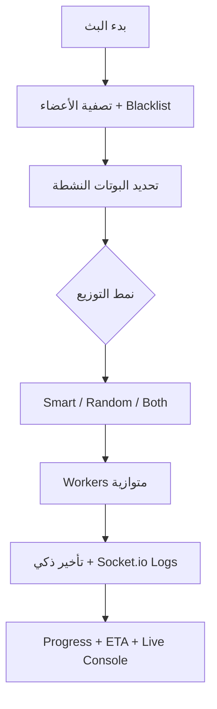
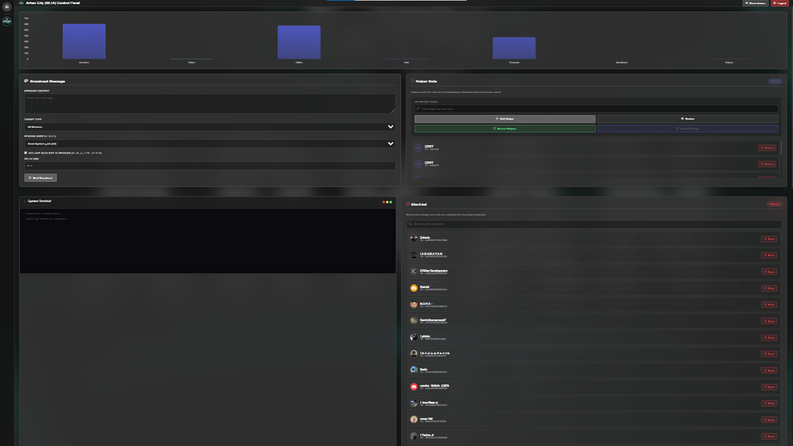

<p align="center">

  <picture>
    <source media="(prefers-color-scheme: dark)" srcset="public/models/Banner.webp">
    
  </picture>
</p>

<p align="center">
  <a href="https://discord.com/users/640239524361797699">
    
  </a>
  <a href="https://github.com/kaennn9/discord-broadcast-system">
    
  </a>
  <a href="https://github.com/kaennn9/discord-broadcast-system/stargazers">
    
  </a>
</p>

<h1 align="center">نظام البث الشامل لديسكورد</h1>

<p align="center">
  <strong>نظام Full-Stack احترافي متطور لإدارة وتشغيل عدة بوتات ديسكورد مع توزيع ذكي ومتوازي لحمل الرسائل الخاصة (DMs)</strong>
</p>

<p align="center">
   
  <strong>Node.js • Express • Socket.io</strong> • 
   
  <strong>discord.js</strong> • 
  <strong>EJS + Chart.js</strong>
</p>

---

## ✨ المميزات الرئيسية

- **تشغيل متعدد البوتات** — بوت رئيسي + عدد غير محدود من البوتات المساعدة (Helper Bots)
- **3 أنماط توزيع ذكية** — Smart • Random • Both (الأفضل لتجنب الكشف)
- **حماية متقدمة من Rate Limits** والباند
- **لوحة تحكم مظلمة فاخرة** بتصميم مستوحى من Discord + Glassmorphism + تأثيرات متحركة
- **نظام أمان قوي** — Owner Access + Guest Access مع **Device Fingerprint Lock**
- **كونسول حي ذكي** — تحديث تلقائي + شريط تقدم + تقدير وقت ذكي (ETA)
- **مراقبة أخطاء متقدمة** (BotFailureL) — تسجيل + نسخ احتياطية + Webhook Notifications
- **دعم كامل للغة العربية** (RTL) + تصميم متجاوب
- **تأثيرات متحركة** — أزرار Hover، Modals سلسة، Progress Bar متحرك، Sidebar متحرك، Glass Effects
- **Chart.js إحصائيات حية** — رسوم بيانية متحركة للأعضاء والحالة
- **Blacklist محلية** لكل سيرفر
- **نظام دعوات ضيوف آمن** (24 ساعة + قفل بصمة الجهاز)
- **Auto-Start** للبوتات عند إعادة تشغيل السيرفر
- **تحديث Avatar & Presence** مباشرة من اللوحة

---

## 📂 هيكل المجلدات

```text
ejs/
├── data/db.db
├── public/
│   ├── css/style.css
│   └── models/
│       ├── Banner.webp
│       ├── views.png
│       └── views2.png
├── src/
│   ├── BotFailureL.js
│   ├── botManager.js
│   ├── db.js
│   ├── index.js
│   ├── routes.js
│   └── utils.js
├── views/
│   ├── index.ejs
│   ├── server.ejs
│   ├── login.ejs
│   └── invite.ejs
├── .env
├── package.json
└── README.md
```

---

## 🛠️ نظرة تقنية على الملفات

### `src/index.js`
تهيئة الخادم + Socket.io + Auto-start للبوتات.

### `src/botManager.js`
إدارة كاملة لدورة حياة البوتات (Start / Stop / Avatar / Presence).

### `src/utils.js`
- `SmartTimeEstimator` — تقدير وقت ذكي
- `SmartConsoleLogger` — كونسول ذكي (تحديث كل 6 ثوانٍ)

### `src/BotFailureL.js`
نظام مراقبة الأخطاء الحرجة مع إشعارات ونسخ احتياطية.

### `src/routes.js`
جميع APIs + حماية + Blacklist + Invite System + Cache.

### `views/server.ejs`
لوحة التحكم المتكاملة:
- إحصائيات Chart.js متحركة
- نموذج البث المتقدم
- إدارة Helper Bots (Modals)
- كونسول حي ملون
- Blacklist Panel
- Share Access Modal

---

## ⚡ آلية البث



---

## 🚀 التثبيت والتشغيل

```bash
git clone https://github.com/kaennn9/discord-broadcast-system.git
cd discord-broadcast-system

npm install

# إنشاء ملف البيئة
cp .env.example .env
```

**مثال `.env`**:
```env
PORT=3000
MASTER_PASSWORD=admin123admin123
# WEBHOOK_URL=https://discord.com/api/webhooks/...
```

```bash
# تطوير (مع إعادة تحميل تلقائي)
npm run dev

# إنتاج
npm start
```

افتح المتصفح على: `http://localhost:3000`

---

## 📸 لقطات الشاشة




*(أضف المزيد من الصور بعد رفعها على GitHub)*

---

<p align="center">
  <a href="https://github.com/kaennn9/discord-broadcast-system">
    
    <strong>إذا أعجبك المشروع، لا تنسَ تعطيه ⭐</strong>
    
  </a>
</p>

<p align="center">
  <strong>صنع بحب لمجتمع ديسكورد العربي</strong><br>
  
</p>

**License**: MIT © [YOUR NAME](https://github.com/kaennn9)

---
