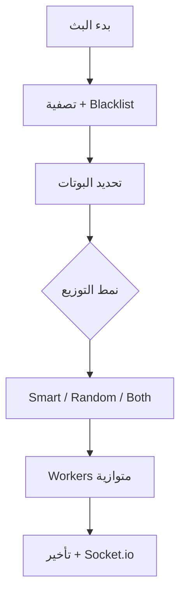
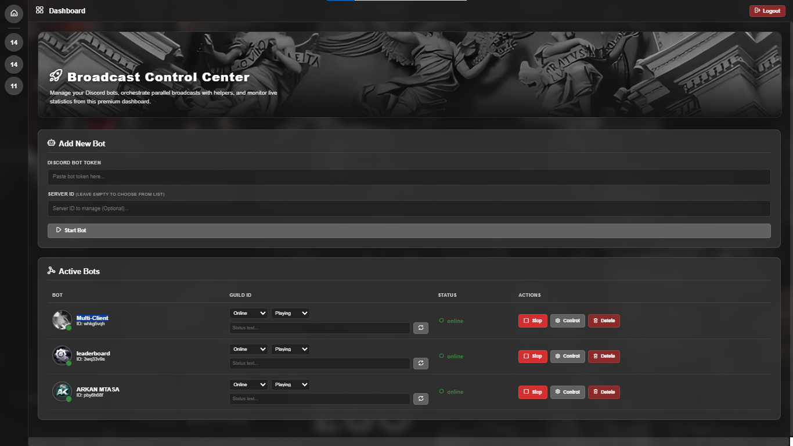

<p align="center">

  <picture>
    <source media="(prefers-color-scheme: dark)" srcset="public/models/Banner.webp">
    
  </picture>
</p>

<p align="center">
  <a href="https://discord.com/users/1188494987520909422">
    
  </a>
  <a href="https://github.com/kaennn9">
    
  </a>
  <a href="https://github.com/YOUR_USERNAME/discord-broadcast-system/stargazers">
    
  </a>
</p>

<h1 align="center">نظام البث الشامل لديسكورد</h1>

<p align="center">
  <strong>نظام Full-Stack احترافي لإدارة وتشغيل عدة بوتات ديسكورد مع توزيع ذكي لحمل الرسائل الخاصة (DMs)</strong>
</p>

<p align="center">
   
  <strong>Node.js • Express • Socket.io</strong> • 
   
  <strong>discord.js</strong>
</p>

---

## ✨ المميزات الرئيسية

- **تشغيل متعدد البوتات**: بوت أساسي + بوتات مساعدة (Helper Bots)
- **توزيع حمل ذكي**: 3 أنماط (Smart • Random • Both)
- **حماية من Rate Limits** والباند
- **لوحة تحكم مظلمة** بتصميم Discord-like + Glassmorphism
- **نظام أمان قوي**: Owner + Guest Access مع **Device Fingerprint Lock**
- **كونسول ذكي** مع شريط تقدم وتقدير وقت ذكي (ETA)
- **مراقبة أخطاء متقدمة** (BotFailureL) مع Webhook ونسخ احتياطية
- **دعم كامل للغة العربية** (RTL)

---

## 📂 هيكل المجلدات

```text
ejs/
├── data/db.db
├── public/
│   ├── css/style.css
│   ├── models/Banner.webp
│   └── models/views.png
├── src/
│   ├── BotFailureL.js
│   ├── botManager.js
│   ├── db.js
│   ├── index.js
│   ├── routes.js
│   └── utils.js
├── views/
│   ├── index.ejs
│   ├── server.ejs
│   ├── login.ejs
│   └── invite.ejs
├── .env
├── package.json
└── README.md
```

---

## 🛠️ نظرة تقنية على الملفات

### `src/index.js`
تهيئة Express + Socket.io + Auto-start للبوتات عند تشغيل السيرفر.

### `src/botManager.js`
إدارة كاملة للبوتات (تشغيل/إيقاف/Avatar/Presence).

### `src/utils.js`
- `SmartTimeEstimator` (تقدير الوقت الذكي)
- `SmartConsoleLogger` (تحديث ذكي كل 6 ثوانٍ)

### `src/BotFailureL.js`
نظام مراقبة الأخطاء الحرجة مع تسجيل، نسخ احتياطية، وإشعارات.

### `src/routes.js`
جميع الـ APIs مع حماية Owner/Guest + Blacklist + Invite System.

### `views/server.ejs`
أقوى لوحة تحكم تحتوي على:
- Chart.js إحصائيات
- نموذج البث
- إدارة Helper Bots
- كونسول حي
- Blacklist
- نظام دعوات الضيوف

---

## ⚡ آلية البث



---

## 🚀 التثبيت والتشغيل

```bash
git clone https://github.com/YOUR_USERNAME/discord-broadcast-system.git
cd discord-broadcast-system

npm install

# إعداد الملفات البيئية
cp .env.example .env
```

**`.env` مثال:**
```env
PORT=3000
MASTER_PASSWORD=admin123admin123
# WEBHOOK_URL=your_webhook_here
```

```bash
# تشغيل التطوير
npm run dev

# تشغيل الإنتاج
npm start
```

ثم افتح: `http://localhost:3000`

---

## 📸 لقطات الشاشة



*(أضف المزيد من الصور هنا بعد رفعها)*

---

<p align="center">
  <a href="https://github.com/kaennn9/discord-broadcast-system">
    
    <strong>إذا أعجبك المشروع، لا تنسَ تعطيه ⭐</strong>
    
  </a>
</p>

<p align="center">
  <strong>صنع بحب لمجتمع ديسكورد العربي</strong>
</p>

**License**: MIT © [YOUR NAME](https://github.com/kaennn9)
```

---"Known Issues" أو أي تعديل آخر؟
