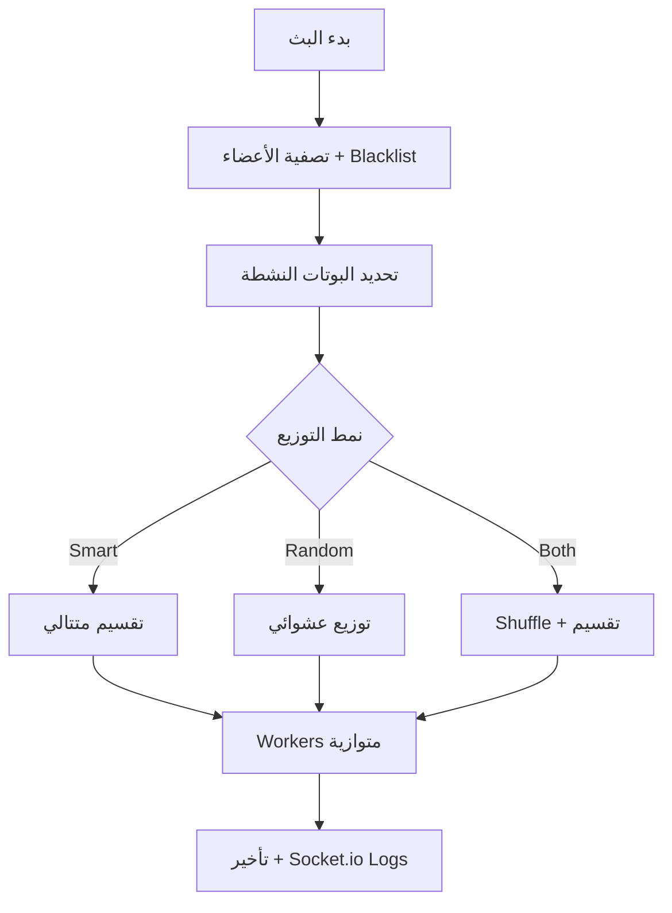

<p align="center">

  <picture>
    <source media="(prefers-color-scheme: dark)" srcset="https://github.com/kaennn9/embedskaen/blob/main/assets/banner-dark.png?raw=true">
    
  </picture>
</p>

<p align="center">
  <a href="https://discord.com/users/1188494987520909422">
    
  </a>
  <a href="https://github.com/kaennn9">
    
  </a>
  <a href="https://github.com/YOUR_USERNAME/discord-broadcast-system/stargazers">
    
  </a>
</p>

<h1 align="center">
  
  نظام البث الشامل لديسكورد
</h1>

<p align="center">
  <strong>نظام Full-Stack احترافي لإدارة وتشغيل عدة بوتات ديسكورد مع توزيع حمل البث الخاص (DMs) بذكاء وسرعة فائقة</strong>
</p>

<p align="center">
  
  <strong>Node.js + Express + Socket.io</strong> • 
  
  <strong>discord.js</strong> • 
  
  <strong>Local JSON DB</strong>
</p>

---

## ✨ المميزات الرئيسية

| الميزة                        | الوصف                                              |
|-------------------------------|---------------------------------------------------|
| **بوتات متعددة**             | تشغيل بوت أساسي + بوتات مساعدة (Helpers)        |
| **توزيع ذكي للحمل**          | Smart / Random / Both Systems                     |
| **حماية من Rate Limits**     | تأخير ذكي + توزيع متوازي                           |
| **لوحة تحكم مظلمة**          | تصميم Discord-like + Glassmorphism                |
| **دخول آمن**                  | Owner + Guest Access مع Device Fingerprint Lock   |
| **كونسول ذكي**               | تحديث كل 6 ثوانٍ + شريط تقدم + ETA               |
| **مراقبة الأخطاء**           | BotFailureL مع إشعارات Webhook ونسخ احتياطية     |
| **دعم RTL**                   | واجهة عربية كاملة                                |

---

## 📂 هيكل المجلدات

```text
ejs/
├── data/
│   └── db.db                     # قاعدة البيانات المحلية (JSON)
├── public/
│   ├── css/
│   │   └── style.css
│   ├── models/                   # الصور والبنرات
│   └── uploads/                  # رفع الصور المؤقت
├── src/
│   ├── BotFailureL.js
│   ├── botManager.js
│   ├── db.js
│   ├── index.js
│   ├── routes.js
│   └── utils.js
├── views/
│   ├── index.ejs
│   ├── invite.ejs
│   ├── login.ejs
│   └── server.ejs
├── .env
├── main.py                       # ربط Spotify (اختياري)
├── package.json
└── README.md
```

---

## 🛠️ شرح الملفات البرمجية

### `src/index.js`
نقطة بداية التطبيق. يقوم بتهيئة Express + Socket.io + EJS وتشغيل البوتات تلقائياً عند إعادة تشغيل السيرفر.

### `src/db.js`
قاعدة بيانات محلية بسيطة وقوية تعتمد على JSON.

### `src/botManager.js`
مدير البوتات: تشغيل، إيقاف، تحديث الـ Avatar والـ Presence.

### `src/utils.js`
دوال مساعدة + **SmartTimeEstimator** + **SmartConsoleLogger**.

### `src/BotFailureL.js`
نظام مراقبة الأخطاء الحرجة مع تسجيل، نسخ احتياطية، وإشعارات.

### `src/routes.js`
جميع الـ APIs والمسارات مع نظام حماية Owner/Guest.

---

## ⚡ آلية البث



---

## 🔒 الأمان والضيوف

- **Owner Access**: كلمة مرور رئيسية.
- **Guest Access**: روابط دعوة مؤقتة (24 ساعة) مقفلة بـ **Device Fingerprint**.
- **Blacklist** محلية لكل سيرفر.

---

## 🚀 التثبيت

### المتطلبات
- Node.js v18+
- حساب Discord Developer

### خطوات التشغيل

```bash
# 1. استنساخ المشروع
git clone https://github.com/YOUR_USERNAME/discord-broadcast-system.git
cd discord-broadcast-system

# 2. تثبيت الاعتماديات
npm install

# 3. إعداد .env
cp .env.example .env
```

**مثال على `.env`**:
```env
PORT=3000
MASTER_PASSWORD=admin123admin123
# WEBHOOK_URL= (اختياري)
```

```bash
# تشغيل في وضع التطوير
npm run dev

# تشغيل الإنتاج
npm start
```

افتح المتصفح على `http://localhost:3000`

---

## 📸 صور توضيحية

*(أضف صور شاشة حقيقية هنا بعد رفعها)*

---

<p align="center">
  <a href="https://github.com/YOUR_USERNAME/discord-broadcast-system">
    
    <strong>إذا أعجبك المشروع، لا تنسَ تعطيه ⭐</strong>
    
  </a>
</p>

<p align="center">
  <strong>صنع بحب لمجتمع ديسكورد العربي</strong><br>
  
</p>

---

**License**: MIT © [YOUR NAME](https://github.com/kaennn9)
```
هل تريد تعديل أي قسم إضافي أو إضافة ميزات جديدة؟
