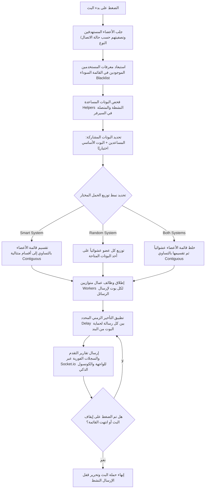

# نظام البث الشامل لديسكورد (Discord Broadcast System)

نظام متكامل واحترافي (Full-Stack) يعتمد على **Node.js (Express & Socket.io)** لإدارة وتشغيل عدة بوتات ديسكورد في نفس الوقت، وتوزيع حمل إرسال الرسائل الخاصة (Direct Messages - DMs) لأعضاء خوادم ديسكورد (Guilds) عبر البوت الأساسي وبوتات مساعدة متعددة (Helper Bots) بشكل متوازٍ وسريع لتفادي حظر البوتات وتجاوز قيود معدل الإرسال (Rate Limits).

تتميز لوحة التحكم بواجهات بتصميم مظلم مستوحى من ديسكورد مع دعم لنظام الدخول المحمي للمالك ونظام دعوات الضيوف المؤمن بالبصمة الرقمية للجهاز (Device Fingerprint Lock).

---

## 📂 هيكل المجلدات والملفات (Directory Structure)

```text
ejs/
├── data/
│   └── db.db                     # قاعدة البيانات المحلية (ملف JSON لحفظ البيانات والخيارات)
├── public/
│   ├── css/
│   │   └── style.css             # التنسيقات والمؤثرات البصرية للوحة التحكم
│   ├── models/                   # الخلفيات والصور والبنرات التوضيحية
│   └── uploads/                  # مجلد تخزين مؤقت لرفع الصور وتحديث رمزيات البوتات
├── src/
│   ├── BotFailureL.js            # نظام ذكي لتتبع وتوثيق وتنبيه أخطاء البوتات الفادحة
│   ├── botManager.js             # فئة لإدارة دورة حياة عملاء ديسكورد (تشغيل/إيقاف/تحديث حالة)
│   ├── db.js                     # واجهة التعامل مع قاعدة البيانات المحلية لقراءة وكتابة ملف JSON
│   ├── index.js                  # نقطة البداية للمشروع، تهيئة خوادم ويب وسوكيت والتشغيل التلقائي
│   ├── routes.js                 # مسارات الويب وعمليات التحكم بالبوتات والبث والتحقق والدعوات
│   └── utils.js                  # دوال المساعدة، نظام تقدير الوقت الذكي ومسجل الكونسول المطور
├── views/
│   ├── index.ejs                 # لوحة التحكم الرئيسية لإدارة البوتات وحالتها النشطة
│   ├── invite.ejs                # صفحة التحقق من دعوة الضيف والدخول الآمن للتحكم بسيرفر محدد
│   ├── login.ejs                 # صفحة تسجيل دخول المسؤول العام (Master Access)
│   └── server.ejs                # لوحة التحكم التفصيلية للسيرفر (البث، المساعدين، الكونسول، الحظر)
├── .env                          # ملف تهيئة المتغيرات البيئية والإعدادات السرية
├── index.html                    # تطبيق فرعي بسيط باللغة العربية لعرض وقياس أبعاد الشاشة
├── main.py                       # سكربت بايثون مستقل لربط حالة ديسكورد بأغاني سبوتيفاي المستمع إليها
├── package.json                  # ملف حزم الاعتماديات وأوامر التشغيل الخاصة بـ Node.js
└── README.md                     # التوثيق الشامل للنظام (هذا الملف)
```

---

## 🛠️ الشرح التفصيلي لملفات النظام البرمجية (File-by-File Technical Deep Dive)

### 1️⃣ المجلد البرمجي الرئيسي `src`

#### 📄 [index.js](file:///c:/Users/mohoo/Downloads/ejs/src/index.js)
الملف المسؤول عن بدء خادم التطبيق وتجميع المكونات الأساسية.
*   **الوظائف الأساسية**:
    *   إنشاء خادم ويب باستخدام **Express**.
    *   تهيئة خادم اتصالات فوري باستخدام **Socket.io** لمشاركة الأحداث الفورية (Logs & Progress) مع الواجهة الرسومية وتخزينه في خيارات التطبيق (`app.set('io', io)`).
    *   إعداد محرك القوالب **EJS** وتحديد مجلد الواجهات (`views`) والمجلد العام للملفات الثابتة (`public`).
    *   تمرير طلبات الميثود وتنسيق JSON عبر الـ Middlewares الافتراضية.
    *   **التشغيل التلقائي (Auto-Start)**: عند بدء الخادم، يقوم بقراءة كافة البوتات المسجلة في قاعدة البيانات وحالتها "online" وإعادة تشغيلها تلقائياً. كما يعيد تشغيل كافة البوتات المساعدة (Helpers) المرتبطة بالخوادم تلقائياً لضمان عدم توقف الخدمة عند إعادة تشغيل السيرفر.
*   **المنافذ**: يعمل افتراضياً على المنفذ المذكور في ملف البيئة أو المنفذ `3000`.

#### 📄 [db.js](file:///c:/Users/mohoo/Downloads/ejs/src/db.js)
محرك قواعد بيانات مبسط ومحلي بالكامل يعتمد على نظام الملفات التزامن في Node.js لقراءة وكتابة ملف JSON.
*   **موقع التخزين**: `data/db.db` (ملف نصي منسق بصيغة JSON).
*   **الهيكل الافتراضي للبيانات**:
    ```json
    {
      "bots": {},
      "sessions": {},
      "logs": [],
      "settings": {}
    }
    ```
*   **الدوال المصدرة**:
    *   `loadDB()`: يتحقق من وجود المجلد والملف، وينشئهما بقيم افتراضية إذا لم يوجدا، ثم يحلل محتويات الملف ويرجع كائن البيانات.
    *   `saveDB(data)`: يكتب كائن البيانات بصيغة JSON منسقة في الملف.
    *   `set(key, value)`: يقوم بتحديث قيمة مفتاح معين في قاعدة البيانات وحفظ التعديلات فوراً.
    *   `get(key)`: يستعلم عن قيمة مفتاح محدد ويعيد محتواه.

#### 📄 [botManager.js](file:///c:/Users/mohoo/Downloads/ejs/src/botManager.js)
المدير البرمجي المسؤول عن تهيئة والتحكم بكافة كائنات البوتات وعملاء ديسكورد (`discord.js`).
*   **الوظائف الأساسية**:
    *   تخزين كائنات البوتات النشطة في ذاكرة التطبيق داخل كائن `Map` يسمى `clients` باستخدام معرف جلسة (`sessionId`).
    *   `startBot(token, guildId, isHelper)`:
        *   يتحقق من عدم تكرار البوت باستخدام التوكن.
        *   ينشئ معرف جلسة عشوائي فريد إذا لم يكن البوت مسجلاً مسبقاً.
        *   يقوم بإنشاء عميل ديسكورد جديد مع تحديد الـ **Gateway Intents** المطلوبة بدقة: `Guilds` (الخوادم)، `GuildMembers` (الأعضاء)، `GuildMessages` (الرسائل)، `MessageContent` (محتوى الرسائل)، و `GuildPresences` (حالة اتصال الأعضاء).
        *   يسجل الدخول للبوت ويخزن بياناته (الاسم، الرمزية الحالية، المعرف) في قاعدة البيانات للتشغيل التلقائي (إذا لم يكن البوت معرّفاً كـ Helper).
    *   `stopBot(sessionId)`: يقوم بإغلاق جلسة البوت (`client.destroy()`) وحذفها من الذاكرة وتحديث حالتها في قاعدة البيانات إلى `offline`.
    *   `updateAvatar(sessionId, imagePath)`: يرفع رمزية جديدة لحساب البوت على خوادم ديسكورد ويحدث رابط الرمزية الجديد في قاعدة البيانات المحلية.
    *   `updatePresence(sessionId, { status, type, text })`: يضبط حالة اتصال البوت على ديسكورد (نشط، مشغول، خامل، مخفي) وتخصيص النشاط (Playing, Streaming, Listening, Watching) والنص المرافق له.

#### 📄 [utils.js](file:///c:/Users/mohoo/Downloads/ejs/src/utils.js)
ملف الأدوات المساعدة وتقدير الأوقات والخوارزميات الرياضية لعمليات البث.
*   **الدوال البسيطة**:
    *   `sleep(ms)`: دالة انتظار مؤقتة مبنية على الـ Promises لمقاطعة تنفيذ الكود لعدد محدد من الميلي ثانية (تُستخدم لتأخير إرسال الرسائل).
    *   `createLogger(context)`: منشئ سجلات ملونة للكونسول لتسهيل قراءة الأحداث والأخطاء.
    *   `formatNumber(num)`: إضافة فواصل الآلاف للأرقام الكبيرة لسهولة القراءة.
    *   `generateId()`: توليد معرفات عشوائية فريدة طويلة.
    *   `createProgressBar(percent, size)`: رسم شريط تقدم نصي باستخدام المربعات (`█` و `░`).
    *   `formatTime(ms)`: تحويل الميلي ثانية إلى صيغة نصية مقروءة (ساعات، دقائق، ثوانٍ).
*   **خوارزمية تقدير الوقت الذكية `SmartTimeEstimator`**:
    *   تحسب الوقت المنقضي الفعلي منذ بدء البث.
    *   تقوم بحساب سرعة الإرسال الحالية (أعضاء/ثانية).
    *   تبدأ في تقديم تقديرات للوقت المتبقي (`ETA Timestamp`) بعد تجاوز إرسال **50 رسالة** لضمان استقرار قراءة المتوسط الحسابي وتجنب القفزات الكبيرة في التقدير.
*   **نظام كونسول المطورين الذكي `SmartConsoleLogger`**:
    *   تمنع هذه الفئة اغراق واجهة الـ Terminal بسطور السجلات المتكررة عند إرسال آلاف الرسائل.
    *   تقوم بتحديث شاشة الكونسول بشكل ذكي ومؤتمت كل **6 ثوانٍ** فقط أو عند إرسال أول وآخر رسالة.
    *   تقوم بمسح الواجهة وإعادة رسم لوحة إحصائيات منسقة بالكامل تحتوي على شريط تقدم بصري ونسب مئوية، وإحصاءات كاملة عن الرسائل الناجحة والفاشلة والمتبقية، بالإضافة إلى تحليل شامل للوقت المتبقي وتوقع ساعة الانتهاء الدقيقة بناءً على أداء السيرفر الحالي.

#### 📄 [BotFailureL.js](file:///c:/Users/mohoo/Downloads/ejs/src/BotFailureL.js)
نظام متطور ومستقل بالكامل مخصص لمراقبة وتوثيق الفشل البرمجي الفادح للبوتات (مثل إيقاف التوكن، تبنيد البوت، طرده من السيرفر، أو تعرضه للتقييد الشديد).
> [!NOTE]
> هذا الملف لا يسجل الأخطاء الطبيعية واليومية مثل إغلاق المستخدم لخاصية الرسائل الخاصة أو قيام عضو بحظر البوت؛ بل يركز فقط على الأخطاء التي تمنع البوت من العمل كلياً.
*   **المميزات وإدارة الملفات**:
    *   يكتب السجلات في ملف مستقل باسم `bot_failures.json` في المجلد الرئيسي للتطبيق.
    *   يحتفظ بنسخ احتياطية تلقائية في مجلد `backups/` مع أخذ لقطة زمنية لكل تغيير، ويقوم بتدوير السجلات تلقائياً بالاحتفاظ بآخر 5 نسخ احتياطية فقط وبحد أقصى 1000 سجل ولمدة صلاحية 30 يوماً لتوفير مساحة التخزين.
    *   يعمل بنظام الكتابة المتسلسلة التزامنية الآمنة (`_writeChain`) لتجنب تداخل عمليات الكتابة على نفس الملف على الهاردسك.
*   **تصنيف الأخطاء الحرجة**:
    يحتوي على قاموس كامل بأكواد الخطأ الخاصة بـ Discord Gateway و HTTP:
    *   `4004`: توكن البوت غير صالح أو تم إبطاله.
    *   `40003` أو رسائل تحتوي على `flagged`/`banned`: حساب البوت تم حظره أو قفله من قبل شركة Discord.
    *   `50001`: البوت تم طرده من السيرفر المستهدف.
    *   `50013`: صلاحيات البوت في السيرفر غير كافية للقيام بالوظائف الأساسية.
    *   `429` (بشرط أن يكون وقت الانتظار المطلوب أطول من ساعة): تقييد شديد لمعدل الطلبات.
    *   المشاكل المتعلقة بـ CloudFlare (مؤشر على حظر الأي بي الخاص بالخادم مؤقتاً).
    *   أخطاء الاتصال بالإنترنت التابعة لديسكورد (`ECONNREFUSED`, `ETIMEDOUT`, `ENOTFOUND`).
*   **آلية الإشعار والتنبيهات**:
    *   يقوم بطباعة الأخطاء في الكونسول بألوان مميزة وتنبيه عالي الوضوح مبني على مستوى الخطورة (Critical، High، Medium).
    *   يرسل إشعارات فورية مبنية على واجهات الويب (Webhook) إلى سيرفر ديسكورد للمراقبة عن بعد في حال تم تحديد متغير بيئي للـ Webhook.
    *   يقدم إحصائيات تفصيلية عن صحة كل بوت (`isBotHealthy`) وتوصيات برمجية للمطور عما يجب فعله حيال البوت الفاشل.
    *   يدعم إمكانية تصدير سجلات الفشل بالكامل إلى ملفات جداول `CSV` منسقة للتحليل الخارجي.

#### 📄 [routes.js](file:///c:/Users/mohoo/Downloads/ejs/src/routes.js)
عصب التحكم في مسارات الويب وعمليات تبادل البيانات بالكامل وتوجيه الطلبات.
*   **المميزات الأساسية ونظام الحماية**:
    *   تحليل وقراءة ملفات تعريف الارتباط (Cookies) يدوياً عبر ميكانيزم مخصص لمعالجة الـ Headers.
    *   **مستوى صلاحية المالك (Owner Auth)**: يمنع تصفح أي صفحة بدون التحقق من وجود الكوكي `owner_session` بقيمة `true`.
    *   **مستوى صلاحية الضيف (Guest Access)**: يسمح للضيوف الذين يملكون الكوكي `guest_access` بتصفح صفحة السيرفر المرخص لهم فقط وتوجيههم مباشرةً إليها عند محاولة دخول الصفحة الرئيسية للتطبيق وتجريدهم من صلاحيات لوحة التحكم الشاملة.
*   **قائمة المسارات والطلبات (APIs & Routes)**:
    *   `GET /login` & `POST /login`: لعرض صفحة الدخول والتحقق من الرقم السري العام المكون في ملف البيئة (الافتراضي `admin123`).
    *   `GET /logout`: تسجيل الخروج وإبطال ملف الكوكي المعتمد.
    *   `GET /`: الواجهة الرئيسية لعرض البوتات وبدء تشغيل بوت أساسي جديد.
    *   `POST /bot/start`: تشغيل بوت عبر التوكن ومعرف السيرفر وحفظ التعديلات.
    *   `POST /bot/stop`: إيقاف تشغيل بوت مؤقتاً.
    *   `POST /bot/delete`: إيقاف البوت وحذف كافة بياناته من ملف قاعدة البيانات.
    *   `POST /bot/avatar`: رفع صورة جديدة عبر المكون `multer` وحفظها في المجلد المؤقت وتحديث رمزية البوت على ديسكورد ثم حذف الملف المؤقت فوراً.
    *   `POST /bot/presence`: تحديث حالة ونشاط البوت.
    *   `POST /bot/guilds`: فحص التوكن المدخل عبر إنشاء بوت مؤقت وتسجيل الدخول وجلب قائمة السيرفرات التي يتواجد بها ليعرضها للمستخدم على هيئة قائمة خيارات بدلاً من كتابة معرف السيرفر يدوياً.
    *   `POST /guild/helper/add`: تسجيل توكن بوت مساعد جديد والتحقق من صحته وبدء تشغيله الفوري وإضافته لقائمة المساعدين المحددة للسيرفر الحالي.
    *   `POST /guild/helper/remove`: حذف وإيقاف بوت مساعد معين.
    *   `POST /guild/helpers/restart`: إعادة تشغيل كافة البوتات المساعدة للخادم الحالي دفعة واحدة لحل مشاكل الاتصال.
    *   `POST /guild/helper/settings/identity` & `/presence`: تحديث اسم وحالة اتصال والنشاط الترفيهي للبوتات المساعدة.
    *   `POST /guild/helper/webhook`: تعيين رابط ويب هوك لحفظ إرسال تقارير الأخطاء الخاصة بالخادم الحالي وتعيينها لملف البيئة.
    *   `POST /guild/blacklist/toggle`: إضافة أو إزالة معرف مستخدم محدد (User ID) من قائمة الحظر المحلية للخادم لمنع البوتات من مراسلته مستقبلاً.
    *   `GET /server/:id/:guildId`: لوحة تحكم السيرفر المحددة. **تتضمن نظام كاش ذكي (Cache System)** يقوم بتخزين بيانات السيرفر وأعضائه في الذاكرة لمدة **5 دقائق** لتجنب تكرار جلب الإحصائيات الضخمة من ديسكورد لتلافي تقييد السيرفر وحظر الأي بي الخاص بالويب.
    *   `POST /invite/create`: يقوم بإنشاء رابط دعوة ضيف جديد للسيرفر برقم سري مخصص وكود دعوة محدد وحفظها في قاعدة البيانات.
    *   `GET /invite/:code` & `POST /invite/:code`: عرض واجهة التحقق للضيف والتأكد من تطابق كلمة مرور الدعوة وتعيين الكوكي الخاص بالضيف وإقفال رابط الدعوة على بصمة الجهاز المستخدم لتلافي إعادة نشر الرابط لأطراف أخرى.
    *   `POST /broadcast/stop`: إرسال إشارة لإيقاف حملة الإرسال النشطة فوراً.
    *   `POST /broadcast`: إطلاق حملة البث والمراسلة. (سنشرح آلية العمل التفصيلية بالأسفل).

---

### 2️⃣ مجلد الواجهات الرسومية `views` (قوالب EJS وتفاعل المستخدم)

#### 📄 [index.ejs](file:///c:/Users/mohoo\Downloads\ejs\views\index.ejs)
شاشة العرض الأساسية لمدير النظام بعد تسجيل الدخول كمسؤول.
*   تتكون من قائمة جانبية متحركة تعرض رموز الخوادم النشطة لتسهيل التنقل بينها.
*   تحتوي على بنر جمالي احترافي بأبعاد متجاوبة لعرض معلومات النظام.
*   نموذج ذكي لإضافة بوت رئيسي جديد يدعم الفحص التلقائي للتوكن وعرض خيارات السيرفر المتصل بها كقائمة منسدلة أو إتاحة كتابة معرف السيرفر يدوياً.
*   جدول شامل يعرض كافة البوتات المسجلة وحالة اتصالها وأزرار التحكم المباشر (تشغيل، إيقاف، حذف كلي)، ونماذج فورية مدمجة لتغيير الاسم الرمزية وحالة التواجد في نفس السطر.

#### 📄 [server.ejs](file:///c:/Users/mohoo\Downloads\ejs\views\server.ejs)
لوحة التحكم المتكاملة للتحكم في خادم ديسكورد محدد. وتعتبر اللوحة الأكثر تعقيداً في المشروع.
*   **المكونات التفاعلية**:
    *   **مخطط إحصائي تفاعلي (Chart.js)**: يعرض رسماً بيانياً بأعمدة ملونة جذابة توضح عدد الأعضاء الإجمالي، المتصلين، غير المتصلين، البوتات، القنوات، قائمة الحظر، وعدد المساعدين المتصلين في نفس اللحظة.
    *   **نموذج إعدادات البث (Broadcast Form)**: يتضمن مدخلات نص الرسالة، واختيار المجموعة المستهدفة، وتحديد نمط التوزيع، والتحكم بمعدل التأخير الزمني بالملي ثانية، وخيار استبعاد أو إشراك البوت الأساسي في حملة الإرسال لحماية حسابه الرئيسي.
    *   **قسم المساعدين (Helper Bots)**: واجهة كاملة لإضافة توكنات المساعدين، ومراجعة حالاتهم، وإعادة تشغيلهم وتغيير أسمائهم وصورهم الشخصية وحالاتهم مباشرة من خلال واجهة منبثقة (Modal) مدمجة.
    *   **الكونسول الافتراضي (System Terminal)**: شاشة سوداء منسقة تعرض أحداث إرسال البث الجارية فوريًا باستخدام اتصالات الـ WebSockets المستلمة من السيرفر لإظهار الرسائل الناجحة باللون الأخضر والفاشلة باللون الأحمر.
    *   **لوحة إدارة قائمة الحظر (Blacklist Panel)**: شريط بحث ذكي لتصفية أعضاء السيرفر بالاسم أو بالمعرف (ID) لتسهيل حظرهم أو إلغاء حظرهم من حملة البث الحالية بنقرة زر واحدة ودون الحاجة لتحديث الصفحة.
    *   **نظام مشاركة الصلاحيات (Share Access Modal)**: نافذة توليد روابط الدعوة للضيوف وتعيين كلمات المرور الخاصة بالروابط وعرض النتيجة لنسخها فوراً.

#### 📄 [login.ejs](file:///c:/Users/mohoo\Downloads\ejs\views\login.ejs)
شاشة القفل الرئيسية للمسؤولين.
*   تصميم عصري بسيط بلون أسود داكن وتأثير زجاجي مشوش (Backdrop blur) على خلفية لوحة التحكم.
*   تتحقق من كلمة المرور المدخلة عبر طلب POST وتعرض رسالة خطأ واضحة في حال كانت المحاولة خاطئة.

#### 📄 [invite.ejs](file:///c:/Users/mohoo\Downloads\ejs\views\invite.ejs)
واجهة تسجيل دخول الضيوف الحاصلين على رابط دعوة مخصص للسيرفر.
*   تحتوي على حقل لإدخال كلمة المرور الخاصة بالدعوة.
*   **كود تأمين الجهاز**: يتضمن السكربت كود جافاسكريبت يقوم بتوليد معرف فريد للمتصفح وحفظه في `localStorage`. عند إرسال كلمة المرور، يرسل هذا المعرف كبصمة للجهاز (`deviceId`) ليتم قفله في قاعدة البيانات مع كود الدعوة؛ لمنع أي جهاز أو متصفح آخر من استخدام نفس رابط الدعوة حتى لو امتلك كلمة المرور الصحيحة.

---

### 3️⃣ الملفات الخدمية الأخرى في المجلد الرئيسي

#### 📄 [main.py](file:///c:/Users/mohoo\Downloads\ejs\main.py)
سكربت بايثون مستقل تماماً عن بيئة Node.js، وهو عبارة عن أداة ربط لحساب ديسكورد الشخصي بالموسيقى المستمع إليها في Spotify.
*   **المميزات البرمجية والتعديلات**:
    *   يعمل السكربت على قراءة آخر الأغاني التي استمع إليها المستخدم من حسابه في سبوتيفاي باستخدام مكتبة `spotipy` والتوكنات المعتمدة.
    *   **تجاوز قيود حساب سبوتيفاي المجاني**: تم تعديل السكربت ليعتمد على خاصية "الاستماع الأخير" (`recently played`) بدلاً من "الاستماع المباشر الفوري" للعمل بدون الحاجة لامتلاك حساب Spotify Premium.
    *   يستخدم السكربت مكتبة الطلبات غير المتزامنة `grequests` لعمل تحديث مستمر وسريع للـ Bio (السيرة الذاتية) وحالة الـ Custom Status الخاصة بحساب الديسكورد بالاسم والفرقة الموسيقية بشكل آلي.
    *   يقوم بجلب كلمات الأغنية من سيرفر وسيط خارجي ومحاولة عرضها على حالة ديسكورد للمستخدم.

#### 📄 [index.html](file:///c:/Users/mohoo\Downloads\ejs\index.html)
تطبيق صفحة ويب بسيطة باللغة العربية ذات تصميم ملون متدرج مخصصة لعرض إحداثيات الشاشة الحالية للمستخدم.
*   **الوظائف**:
    *   تقرأ أبعاد عرض وطول النافذة بالبكسل فوراً وتحدث القيم المعروضة.
    *   تدعم إعادة الحساب التلقائي عند تغيير حجم المتصفح (Resize) أو تحميل الصفحة.
    *   تحتوي على زر تحديث يدوي مضاف إليه تأثير حركة ومؤقت زمني لتوضيح آخر وقت تم فيه رصد الأبعاد.

#### 📄 [style.css](file:///c:/Users/mohoo\Downloads\ejs\public\css\style.css)
النظام البصري والمظهر الجمالي للوحة التحكم بالكامل.
*   **المميزات التصميمية**:
    *   **المتغيرات (Variables)**: يعتمد على متغيرات CSS مخصصة للألوان لتسهيل التخصيص أو التحويل بين الأنماط (تعتمد على درجات اللون الرمادي الداكن المطفأ `#2b2b2b` مع تداخل اللون الأخضر للنجاح والأحمر للأخطاء والرمادي المتوسط للـ Accent).
    *   **التأثيرات الزجاجية (Glassmorphism)**: استخدام دالة الخلفية المشوشة `backdrop-filter: blur(12px)` على بطاقات الكروت ولوحات التحكم والواجهات المنبثقة لإعطاء طابع عصري فاخر ورؤية أجزاء من صور الخلفية بشكل ناعم.
    *   **شريط التقدم المطور**: تنسيق شريط التقدم الدائري والحركي مع إضافة ظلال متوهجة خفيفة (`box-shadow`) تعطي طابعاً تفاعلياً ممتازاً أثناء عمليات الإرسال الحية.
    *   **التجاوبية**: يدعم التنسيق الشاشات الصغيرة والهواتف بفضل استخدام جداول متجاوبة وتصنيفات مرنة ومرنة الشبكة (`flex` و `grid`).

---

## ⚡ خوارزمية إرسال البث وتوزيع الحمل (Broadcasting Logic)

عند الضغط على "بدء البث" (Start Broadcast) في صفحة السيرفر، يتبع النظام الخطوات التقنية التالية:



### شرح تفصيلي لأنماط توزيع الإرسال الثلاثة:
1.  **النظام الذكي (Smart System)**:
    يقوم بتقسيم الأعضاء إلى مجموعات متساوية متتالية؛ فإذا كان هناك 100 عضو وبوتان، يستلم البوت الأول الأعضاء من 1 إلى 50، ويستلم البوت الثاني الأعضاء من 51 إلى 100.
2.  **النظام العشوائي (Random System)**:
    يأخذ كل عضو على حدة ويخصصه لبوت عشوائي من البوتات المتاحة دون ترتيب مسبق.
3.  **النظام المشترك (Both Systems)**:
    يقوم بخلط (Shuffle) قائمة الأعضاء بالكامل عشوائياً أولاً، ثم تقسيمهم بالتساوي على البوتات المتاحة بالتتابع، وهو النظام الأقوى لضمان عدم مراسلة الأعضاء المتشابهين في الترتيب بنفس البوت وحمايتها من أنظمة رصد ديسكورد.

---

## 🔒 نظام الدخول الآمن وإدارة الضيوف (Security & Guest Management)

يسمح النظام للمالك العام بمشاركة لوحة تحكم سيرفر محدد مع مشرفين آخرين دون منحهم حق الوصول للوحة التحكم الشاملة للبوتات الأخرى:
1.  **إنشاء الدعوة**: يقوم المالك بكتابة كلمة مرور وتحديد كود للدعوة في السيرفر المطلوب.
2.  **قفل بصمة الجهاز (Fingerprint Lock)**: عند قيام الضيف بكتابة كلمة المرور الصحيحة لفتح الرابط، يسجل النظام البصمة الفريدة لمتصفحه (`deviceId`). إذا تمت محاولة تداول هذا الرابط مع متصفح آخر أو شخص آخر، سيرفض النظام الدخول ويعرض رسالة "تم استخدام هذا الرابط على جهاز آخر"، لضمان عدم خروج التحكم عن نطاق الشخص الموثوق الموجه إليه الرابط.
3.  **فترة الصلاحية**: تعطي الدعوات صلاحية تصفح مؤقتة للضيف مدتها 24 ساعة فقط تنتهي بانتهاء مدة الكوكي المخصص.

---

## 🚀 كيفية التثبيت والتشغيل (Installation & Development Setup)

### 📌 المتطلبات الأساسية
*   تثبيت بيئة عمل **Node.js** (إصدار 18 فما فوق).
*   تثبيت لغة **Python 3** (في حال الرغبة في تشغيل سكربت ربط سبوتيفاي).
*   حساب مطور على منصة Discord وإنشاء تطبيق والحصول على بوت توكن وتفعيل خيارات الـ Gateway Intents الثلاثة (Presence, Server Members, Message Content).

### ⚙️ خطوات الإعداد والتهيئة
1.  قم بفك الضغط وتثبيت اعتماديات خادم الويب:
    ```bash
    npm install
    ```
2.  قم بإنشاء وتعديل ملف الإعدادات البيئية `.env` في المجلد الرئيسي وحظر الكود الخاص بك كالتالي:
    ```env
    PORT=3000
MASTER_PASSWORD=admin123admin123
  3.  بدء تشغيل خادم التطبيق المحلي في وضع التطوير (أوتو ريلود):
    ```bash
    npm run dev
    ```
4.  بدء خادم التطبيق في وضع التشغيل الفعلي المستقر:
    ```bash
    npm start
    ```
5.  تصفح لوحة التحكم مباشرة عبر الرابط التالي:
    ```text
    http://localhost:3000
    ```
